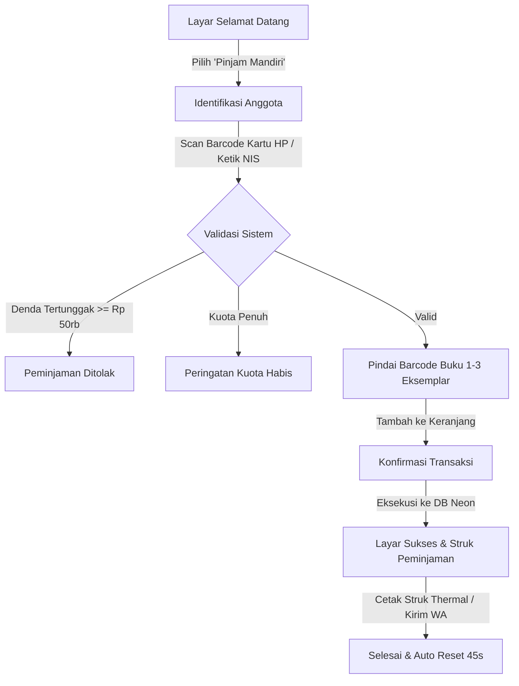
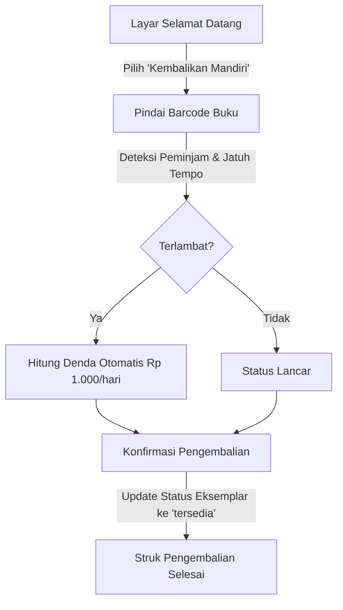

# 🖥️ Dokumentasi Fitur: Mode Kiosk Mandiri Lobi Perpustakaan (Self-Service Kiosk)

> **PustakaKitaCeria — Perpustakaan Digital Sekolah & Kampus**  
> **Modul:** Kiosk Mandiri Lobi (`/kiosk`)  
> **Tanggal Rilis:** 26 September 2026  
> **Status:** Production-Ready & Terverifikasi (Next.js 16 App Router)

---

## 1. Latar Belakang & Masalah

Pada jam istirahat sekolah atau pergantian jam kuliah, meja sirkulasi pustakawan kerap mengalami antrean panjang siswa yang ingin meminjam atau mengembalikan buku. Hal ini menyebabkan:
1. **Beban Kerja Pustakawan Meningkat**: Petugas kelelahan melayani transaksi rutin ketimbang mengelola katalog dan asistensi literasi.
2. **Siswa Mengurungkan Niat Meminjam**: Waktu istirahat yang terbatas (15–30 menit) habis hanya untuk mengantre.
3. **Ketergantungan pada Jam Buka Meja**: Siswa tidak bisa mengembalikan buku saat pustakawan sedang istirahat siang atau rapat staf.

---

## 2. Solusi: Terminal Kiosk Sirkulasi Mandiri (`/kiosk`)

Terminal Kiosk Mandiri adalah mode layar penuh (*dedicated kiosk interface*) yang dirancang khusus untuk diletakkan pada:
- Komputer layar sentuh (*All-in-One Touchscreen PC*) di meja sirkulasi mandiri lobi.
- Tablet iOS (iPad) / Android yang dipasang pada standing mount lobi perpustakaan.

### Fitur Kunci:
- **Dukungan Perangkat Keras Ganda**: Mendukung pemindai kamera web/tablet terintegrasi **DAN** alat tembak barcode kasir (USB / Bluetooth Barcode Gun) dengan pendeteksian otomatis via global listener `keydown`.
- **Identifikasi Cepat Anggota**: Siswa dapat memindai kartu anggota digital di layar HP mereka atau mengetikkan NIS/NIM secara langsung menggunakan On-Screen Touch Numpad.
- **Keranjang Peminjaman Multi-Buku (Multi-Item Cart)**: Siswa dapat memindai 1 hingga 3 buku sekaligus dalam satu sesi transaksi.
- **Pengembalian Mandiri Cepat (Self-Return)**: Cukup scan barcode stiker buku tanpa perlu login kartu anggota. Sistem seketika mendeteksi peminjam, tanggal jatuh tempo, dan status keterlambatan.
- **Bukti Struk Thermal (POS 58mm/80mm)**: Dilengkapi format cetak khusus printer struk kasir thermal via `window.print()` dan opsi notifikasi WhatsApp otomatis.
- **Timer Keamanan Otomatis (Auto-Idle Timer)**: Jika layar ditinggalkan selama 45 detik tanpa interaksi, sesi transaksi otomatis di-reset ke layar awal untuk menjaga privasi data siswa sebelumnya.

---

## 3. Komponen & Struktur File

```
src/
├── actions/
│   └── circulation.ts                 # kioskLookupMemberAction & kioskBatchCheckoutAction
├── app/
│   └── kiosk/
│       ├── layout.tsx                 # Kiosk container & thermal print CSS (@media print)
│       └── page.tsx                   # Terminal interaktif Kiosk (Welcome, Checkout, Return, Receipt)
├── components/
│   └── layout/
│       └── public-header.tsx          # Akses cepat tombol Kiosk Lobi di header & drawer
docs/
└── KIOSK_MODE.md                      # Dokumentasi fitur ini
```

---

## 4. Alur Kerja Pengguna (User Flow)

### A. Peminjaman Buku Mandiri (Self-Checkout)


### B. Pengembalian Buku Mandiri (Self-Return)


---

## 5. Verifikasi & Kualitas Teknis

1. **TypeScript Safety**:
   ```bash
   npx tsc --noEmit
   # Exit code: 0 (0 Errors)
   ```
2. **Next.js Production Build**:
   ```bash
   npm run build
   # Compiled successfully: 45/45 routes (termasuk /kiosk)
   # Exit code: 0 (0 Warnings, 0 Errors)
   ```

---

## 6. Panduan Pengoperasian Kiosk di Lobi

1. Buka browser (Google Chrome / Edge) pada PC / tablet kiosk lobi.
2. Arahkan ke URL: `http://localhost:3000/kiosk` (atau domain produksi).
3. Klik tombol **Layar Penuh (Maximize)** di sudut kanan atas atau tekan `F11` pada keyboard untuk mengaktifkan mode kiosk layar penuh tanpa bilah peramban.
4. Hubungkan alat barcode scanner USB atau aktifkan kamera depan/belakang tablet.
5. Kiosk siap digunakan secara mandiri oleh seluruh siswa dan guru.
