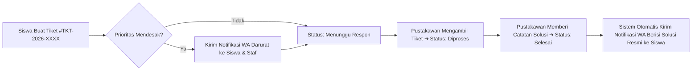

# Dokumentasi Fitur: Pusat Bantuan & Tiket Pengaduan Layanan Perpustakaan (Helpdesk & Live Support)

## 1. Ringkasan Fitur
**Pusat Bantuan & Tiket Pengaduan Layanan Perpustakaan (Helpdesk & Live Support)** adalah kanal layanan terpadu yang dirancang khusus untuk menangani berbagai kendala operasional, sirkulasi, maupun teknis yang dialami pemustaka (siswa & guru) di **PustakaKita Ceria**. Modul ini menyediakan sistem tiket penomoran otomatis (`#TKT-2026-XXXX`), pemantauan status transparan (Menunggu ➔ Diproses ➔ Selesai), pusat FAQ mandiri, hotline WhatsApp darurat pustakawan piket, serta pengiriman pesan WhatsApp otomatis saat tiket diselesaikan oleh pustakawan.

---

## 2. Masalah yang Diselesaikan & Dampak Positif
| Tantangan Operasional Perpustakaan | Solusi Helpdesk & Live Support | Dampak & Nilai Tambah |
| :--- | :--- | :--- |
| **Kepanikan Buku Basah/Rusak**: Siswa takut melapor ketika buku basah terkena hujan atau robek karena khawatir langsung didenda sepihak. | **Kategori Khusus Sirkulasi & Preservasi**: Memberikan ruang pelaporan cepat disertai instruksi penanganan awal (misal: pemberian silica gel di meja piket). | Mengurangi risiko kerusakan koleksi permanen dan menumbuhkan rasa tanggung jawab siswa secara suportif. |
| **Antrean Panjang di Meja Sirkulasi**: Pertanyaan berulang mengenai masa pinjam, denda, atau kartu hilang menyita waktu pustakawan. | **Pusat FAQ Terpadu & Tiket Mandiri**: Jawaban atas pertanyaan umum dapat diakses 24/7 di aplikasi tanpa harus mendatangi perpustakaan. | Efisiensi waktu layanan sirkulasi dan kepuasan pemustaka meningkat tajam. |
| **Barang Siswa Sering Tertinggal**: Botol minum (tumbler), kacamata, atau binder sering tertinggal di area baca lesehan tanpa pencatatan rapi. | **Kategori Lost & Found Terstruktur**: Siswa dapat melaporkan ciri fisik barang dan memeriksa status pengamanan barang oleh petugas. | Mengamankan properti siswa dan mempermudah klaim barang tertinggal. |
| **Kurangnya Kepastian Status Laporan**: Siswa tidak tahu apakah pengaduannya sudah dibaca atau sedang ditangani petugas. | **Transparansi Status & WhatsApp Resolver**: Perubahan status ke *Selesai* langsung mengirim pesan WA resmi ke nomor siswa berisi catatan solusi. | Layanan perpustakaan terasa modern, responsif, dan profesional. |

---

## 3. Kategori Layanan Khusus Perpustakaan
Sistem helpdesk mengakomodasi 5 kategori spesifik perpustakaan sekolah:
1. **`kartu_login` (Kendala Kartu & Akun Login)**:
   - Kartu anggota fisik hilang/rusak, permohonan blokir barcode fisik, lupa kata sandi akun, atau kendala QR code di smartphone.
2. **`sirkulasi_buku` (Sirkulasi, Buku & Denda)**:
   - Pelaporan buku basah terkena hujan, halaman lepas, klaim salah hitung denda, atau konfirmasi buku yang sudah dikembalikan namun masih tercatat aktif.
3. **`ebook_reader` (E-Book & Akses Digital)**:
   - Halaman PDF tidak tampil (blank putih), kendala offline caching pada Progressive Web App (PWA), atau tautan e-book yang bermasalah.
4. **`lost_found` (Barang Tertinggal di Perpustakaan)**:
   - Kacamata, tumbler, flashdisk, kartu pelajar, atau alat tulis yang tertinggal di meja baca atau area lesehan perpustakaan.
5. **`konsultasi_riset` (Riset & Bimbingan Referensi)**:
   - Konsultasi pencarian literatur untuk tugas akhir, karya tulis ilmiah (KTI), lomba karya ilmiah remaja (KIR), atau referensi jurnal/ensiklopedia.

---

## 4. Siklus Hidup Tiket & Notifikasi WhatsApp

- **Tingkat Urgensi**:
  - `normal`: SLA penyelesaian standar 24 jam kalender.
  - `mendesak`: SLA penyelesaian cepat 2-4 jam kerja (disertai pengiriman WhatsApp konfirmasi seketika).
- **Hotline Darurat**:
  - Tombol pintasan langsung membuka WhatsApp web/aplikasi ke nomor Pustakawan Piket (`0812-9876-5432`) untuk keadaan darurat yang membutuhkan respons detik itu juga.

---

## 5. Komponen & Antarmuka Utama

### A. Portal Siswa ([/dashboard/bantuan](file:///d:/project/web/energies/pustakaKita/src/app/%28anggota%29/dashboard/bantuan/page.tsx))
1. **Banner Utama & Status Online Pustakawan**:
   - Indikator jam operasional layanan (Senin–Jumat 07.30–16.00 WIB) dan tombol kontak hotline.
2. **Tab 1: Buat Tiket Pengaduan**:
   - Kartu seleksi 5 kategori layanan berikon intuitif.
   - Pilihan prioritas (*Standard 24h* vs *Mendesak 2-4h*).
   - Kolom subjek dan narasi kendala lengkap.
   - Kotak ringkasan identitas siswa (Nama, NIS, Kelas, No. HP aktif).
3. **Tab 2: Riwayat Tiket Saya**:
   - Daftar tiket yang pernah diajukan siswa dengan lencana status real-time (`Menunggu Respon`, `Sedang Ditangani`, `Selesai`).
   - Kartu dapat diperluas (*accordion*) untuk melihat deskripsi awal laporan, nama pustakawan penanggung jawab, dan **Catatan Solusi / Tanggapan Pustakawan** berbingkai hijau.
4. **Tab 3: FAQ & Pusat Bantuan Mandiri**:
   - 5 Tanya-jawab terverifikasi mengenai sirkulasi, pembayaran denda transfer, kartu digital QR, membaca e-book offline, dan usulan buku baru.
   - Kolom pencarian instan berdasarkan kata kunci.

### B. Panel Pengelola Pustakawan ([/pustakawan/bantuan](file:///d:/project/web/energies/pustakaKita/src/app/%28staff%29/pustakawan/bantuan/page.tsx))
1. **5 Kartu KPI Statistik Operasional**:
   - Total Tiket Masuk, Menunggu Respon (kuning), Sedang Ditangani (biru), Kasus Mendesak (merah/prioritas), dan Tiket Terselesaikan (hijau).
2. **Bilah Pencarian & Multi-Filter**:
   - Pencarian cerdas berdasarkan ID tiket `#TKT-...`, nama siswa, NIS, judul kendala, atau isi laporan.
   - Filter status (`Semua`, `Menunggu`, `Diproses`, `Selesai`).
   - Filter prioritas (`Semua`, `Mendesak`, `Normal`).
3. **Tabel Interaktif Tiket**:
   - Menampilkan detail siswa, tautan klik langsung chat WhatsApp siswa, kategori masalah, cuplikan subjek, dan tombol **"Tanggapi Tiket"**.
4. **Dialog Penyelesaian Kasus (Resolution Modal)**:
   - Pustakawan dapat membaca kronologi kendala siswa secara utuh.
   - Opsi mengubah status tiket menjadi `diproses` atau `selesai`.
   - Mengisi **Catatan Solusi Resmi** (misal arahan penggantian buku, konfirmasi pengambilan kacamata di laci sirkulasi, atau reset PIN).
   - Pengiriman otomatis pesan WhatsApp konfirmasi penyelesaian ke smartphone siswa.

---

## 6. File yang Terlibat
1. [src/actions/helpdesk.ts](file:///d:/project/web/energies/pustakaKita/src/actions/helpdesk.ts):
   - Definisi tipe: `HelpdeskCategory`, `HelpdeskPriority`, `HelpdeskStatus`, `HelpdeskTicket`, dan `FaqItem`.
   - Server Actions: `getHelpdeskTicketsAction`, `submitHelpdeskTicketAction`, `updateTicketStatusAction`, `getHelpdeskStatsAction`, dan `getFaqListAction`.
   - Audit logging & dispatch notifikasi WhatsApp resmi.
2. [src/app/(anggota)/dashboard/bantuan/page.tsx](file:///d:/project/web/energies/pustakaKita/src/app/%28anggota%29/dashboard/bantuan/page.tsx):
   - Halaman pusat bantuan anggota dengan 3 tab interaktif (Buat Tiket, Tiket Saya, FAQ) dan WhatsApp Hotline banner.
3. [src/app/(staff)/pustakawan/bantuan/page.tsx](file:///d:/project/web/energies/pustakaKita/src/app/%28staff%29/pustakawan/bantuan/page.tsx):
   - Panel pustakawan: Ringkasan KPI tiket, tabel pelaporan siswa, modal investigasi kendala, dan tombol penyelesaian kasus.
4. [src/app/(anggota)/layout.tsx](file:///d:/project/web/energies/pustakaKita/src/app/%28anggota%29/layout.tsx):
   - Penambahan menu `Pusat Bantuan` pada bilah navigasi anggota.
5. [src/app/(staff)/layout.tsx](file:///d:/project/web/energies/pustakaKita/src/app/%28staff%29/layout.tsx):
   - Penambahan menu `Pusat Bantuan & Tiket` pada bilah navigasi pustakawan.
